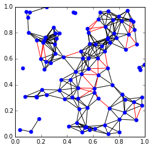
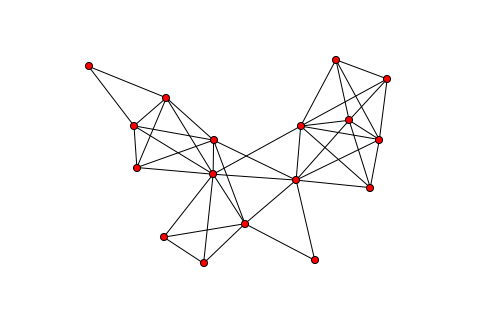
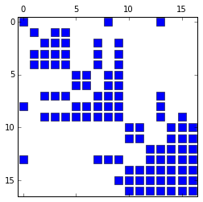
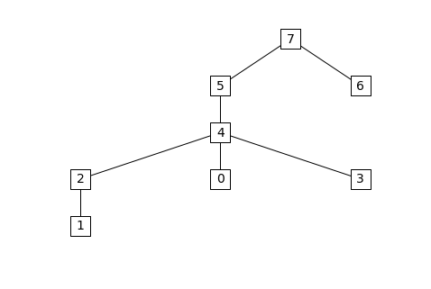

Examples
========

SDP conversion
--------------

This example demonstrates the SDP conversion method. We first generate a
random sparse SDP:

.. code:: python

    
    from cvxopt import matrix, spmatrix, sparse, normal, solvers, blas
    import chompack as cp
    import random
    
    # Function for generating random sparse matrix
    def sp_rand(m,n,a):
        """
        Generates an m-by-n sparse 'd' matrix with round(a*m*n) nonzeros.
        """
        if m == 0 or n == 0: return spmatrix([], [], [], (m,n))
        nnz = min(max(0, int(round(a*m*n))), m*n)
        nz = matrix(random.sample(range(m*n), nnz), tc='i')
        return spmatrix(normal(nnz,1), nz%m, nz/m, (m,n))
    
    # Generate random sparsity pattern and sparse SDP problem data
    random.seed(1)
    m, n = 50, 200
    A = sp_rand(n,n,0.015) + spmatrix(1.0,range(n),range(n))
    I = cp.tril(A)[:].I
    N = len(I)/50 # each data matrix has 1/50 of total nonzeros in pattern
    Ig = []; Jg = []
    for j in range(m):
        Ig += sorted(random.sample(I,N))   
        Jg += N*[j]
    G = spmatrix(normal(len(Ig),1),Ig,Jg,(n**2,m))
    h = G*normal(m,1) + spmatrix(1.0,range(n),range(n))[:]
    c = normal(m,1)
    dims =  {'l':0, 'q':[], 's': [n]};

The problem can be solved using CVXOPT's cone LP solver:

.. code:: python

    
    prob = (c, G, matrix(h), dims)
    sol = solvers.conelp(*prob)
    Z1 = matrix(sol['z'], (n,n))

.. parsed-literal::

         pcost       dcost       gap    pres   dres   k/t
     0: -1.0953e+01 -3.1500e+02  5e+02  5e-01  3e+00  1e+00
     1: -1.8696e+01 -6.3814e+01  5e+01  7e-02  4e-01  8e-01
     2: -2.3027e+01 -3.7585e+01  1e+01  2e-02  1e-01  2e-01
     3: -2.3052e+01 -3.3827e+01  1e+01  2e-02  1e-01  1e-01
     4: -2.3718e+01 -2.6062e+01  2e+00  4e-03  2e-02  3e-02
     5: -2.3700e+01 -2.5631e+01  2e+00  3e-03  2e-02  2e-02
     6: -2.3763e+01 -2.4181e+01  4e-01  7e-04  4e-03  4e-03
     7: -2.3766e+01 -2.3869e+01  1e-01  2e-04  1e-03  6e-04
     8: -2.3766e+01 -2.3793e+01  3e-02  4e-05  3e-04  1e-04
     9: -2.3766e+01 -2.3771e+01  5e-03  8e-06  5e-05  2e-05
    10: -2.3766e+01 -2.3767e+01  7e-04  1e-06  7e-06  4e-06
    11: -2.3766e+01 -2.3766e+01  3e-05  4e-08  3e-07  1e-07
    12: -2.3766e+01 -2.3766e+01  2e-06  4e-09  2e-08  1e-08
    Optimal solution found.

An alternative is to convert the sparse SDP into a block-diagonal SDP
using the conversion method and solve the converted problem using
CVXOPT:

.. code:: python

    
    prob2, blocks_to_sparse, symbs = cp.convert_conelp(*prob)
    sol2 = solvers.conelp(*prob2) 

.. parsed-literal::

         pcost       dcost       gap    pres   dres   k/t
     0: -1.0507e+01 -3.1252e+02  9e+02  8e-01  3e+00  1e+00
     1: -1.7922e+01 -6.5004e+01  6e+01  1e-01  4e-01  2e+00
     2: -2.1583e+01 -4.5680e+01  3e+01  6e-02  2e-01  7e-01
     3: -2.3019e+01 -2.8139e+01  6e+00  1e-02  5e-02  1e-01
     4: -2.3438e+01 -2.5218e+01  2e+00  5e-03  2e-02  4e-02
     5: -2.3684e+01 -2.4060e+01  4e-01  1e-03  4e-03  6e-03
     6: -2.3740e+01 -2.3836e+01  1e-01  2e-04  9e-04  9e-04
     7: -2.3759e+01 -2.3783e+01  3e-02  6e-05  2e-04  1e-04
     8: -2.3764e+01 -2.3769e+01  5e-03  1e-05  5e-05  2e-05
     9: -2.3766e+01 -2.3767e+01  1e-03  3e-06  1e-05  4e-06
    10: -2.3766e+01 -2.3766e+01  3e-04  6e-07  2e-06  7e-07
    11: -2.3766e+01 -2.3766e+01  3e-05  7e-08  2e-07  7e-08
    12: -2.3766e+01 -2.3766e+01  7e-06  2e-08  6e-08  2e-08
    Optimal solution found.

The solution to the original SDP can be found by mapping the
block-diagonal solution to a sparse positive semidefinite completable
matrix and computing a positive semidefinite completion:

.. code:: python

    
    # Map block-diagonal solution sol2['z'] to a sparse positive semidefinite completable matrix
    blki,I,J,bn = blocks_to_sparse[0]
    Z2 = spmatrix(sol2['z'][blki],I,J)
    
    # Compute completion 
    symb = cp.symbolic(Z2, p=cp.maxcardsearch)
    Z2c = cp.psdcompletion(cp.cspmatrix(symb)+Z2, reordered=False)

The conversion can also be combined with clique-merging techniques in
the symbolic factorization. This typically yields a block-diagonal SDP
with fewer (but bigger) blocks than without clique-merging:

.. code:: python

    
    mf = cp.merge_size_fill(5,5)
    prob3, blocks_to_sparse, symbs = chompack.convert_conelp(*prob, coupling = 'full', merge_function = mf)
    sol3 = solvers.conelp(*prob3) 

.. parsed-literal::

         pcost       dcost       gap    pres   dres   k/t
     0: -1.0566e+01 -3.1250e+02  6e+02  6e-01  3e+00  1e+00
     1: -1.7841e+01 -7.0230e+01  6e+01  1e-01  5e-01  1e+00
     2: -2.2301e+01 -4.0449e+01  2e+01  4e-02  2e-01  3e-01
     3: -2.3170e+01 -2.9548e+01  6e+00  1e-02  6e-02  1e-01
     4: -2.3608e+01 -2.4991e+01  1e+00  3e-03  1e-02  1e-02
     5: -2.3715e+01 -2.4159e+01  4e-01  9e-04  4e-03  4e-03
     6: -2.3756e+01 -2.3833e+01  8e-02  2e-04  7e-04  5e-04
     7: -2.3764e+01 -2.3777e+01  1e-02  2e-05  1e-04  6e-05
     8: -2.3765e+01 -2.3769e+01  4e-03  8e-06  4e-05  2e-05
     9: -2.3766e+01 -2.3766e+01  4e-04  8e-07  4e-06  2e-06
    10: -2.3766e+01 -2.3766e+01  1e-04  2e-07  1e-06  4e-07
    11: -2.3766e+01 -2.3766e+01  8e-06  2e-08  7e-08  3e-08
    Optimal solution found.

Finally, we recover the solution to the original SDP:

.. code:: python

    
    # Map block-diagonal solution sol2['z'] to a sparse positive semidefinite completable matrix
    blki,I,J,bn = blocks_to_sparse[0]
    Z3 = spmatrix(sol3['z'][blki],I,J)
    
    # Compute completion 
    symb = cp.symbolic(Z3, p=cp.maxcardsearch)
    Z3c = cp.psdcompletion(cp.cspmatrix(symb)+Z3, reordered=False)

Euclidean distance matrix completion
------------------------------------

Suppose that :math:`A` is a partial EDM of order :math:`n` where the
squared distance :math:`A_{ij} = \| p_i - p_j \|_2^2` between two point
:math:`p_i` and :math:`p_j` is known if :math:`p_i` and :math:`p_j` are
sufficiently close. We will assume that :math:`A_{ij}` is known if and
only if

.. math:: \| p_i - p_j \|_2^2 \leq \delta 

where :math:`\delta` is a positive constant. Let us generate a random
partial EDM based on points in :math:`\mathbb{R}^2`:

.. code:: python

    
    from cvxopt import uniform, spmatrix, matrix
    import chompack as cp
    
    d = 2              # dimension
    n = 100            # number of points (order of A)
    delta = 0.15**2    # distance threshold
    
    P = uniform(d,n)   # generate n points with independent and uniformly distributed coordinates
    Y = P.T*P          # Gram matrix
    
    # Compute true distances:  At[i,j] = norm(P[:,i]-P[:,j])**2
    #   At = diag(Y)*ones(1,n) + ones(n,1)*diag(Y).T - 2*Y
    At = Y[::n+1]*matrix(1.0,(1,n)) + matrix(1.0,(n,1))*Y[::n+1].T - 2*Y
    
    # Generate matrix with "observable distances"
    #   A[i,j] = At[i,j] if At[i,j] <= delta
    V,I,J = zip(*[(At[i,j],i,j) for j in range(n) for i in range(j,n) if At[i,j] <= delta])
    A = spmatrix(V,I,J,(n,n))

The partial EDM :math:`A` may or may not be chordal. We can find a
maximal chordal subgraph using the ``maxchord`` routine which returns a
chordal matrix :math:`A_{\mathrm{c}}` and a perfect elimination order
:math:`p`. Note that if :math:`A` is chordal, then
:math:`A_{\mathrm{c}} = A`.

.. code:: python

    
    Ac,p = cp.maxchord(A)

The points :math:`p_i` and the known distances can be visualized using
Matplotlib:

.. code:: python

    
    from pylab import plot,xlim,ylim,gca
    
    # Extract entries in Ac and entries dropped from A
    IJc = zip(Ac.I,Ac.J)
    tmp = A - Ac
    IJd = [(i,j) for i,j,v in zip(tmp.I,tmp.J,tmp.V) if v > 0]
    
    # Plot edges
    for i,j in IJc:    
        if i > j: plot([P[0,i],P[0,j]],[P[1,i],P[1,j]],'k-')
    for i,j in IJd:
        if i > j: plot([P[0,i],P[0,j]],[P[1,i],P[1,j]],'r-')
    
    # Plot points
    plot(P[0,:].T,P[1,:].T, 'b.', ms=12)
    xlim([0.,1.])
    ylim([0.,1.])
    gca().set_aspect('equal')

The edges represent known distances. The red edges are edges that were
removed to produce the maximal chordal subgraph, and the black edges are
the edges of the chordal subgraph.

Next we compute a symbolic factorization of the chordal matrix
:math:`A_{\mathrm{c}}` using the perfect elimination order :math:`p`:

.. code:: python

    
    symb = cp.symbolic(Ac, p=p)
    p = symb.p

Now ``edmcompletion`` can be used to compute an EDM completion of the
chordal matrix :math:`A_{\mathrm{c}}`:

.. code:: python

    
    X = cp.edmcompletion(cp.cspmatrix(symb)+Ac, reordered = False)

Symbolic factorization
----------------------

This example demonstrates the symbolic factorization. We start by
generating a test problem and computing a symbolic factorization using
the approximate minimum degree (AMD) ordering heuristic:

.. code:: python

    
    import chompack as cp
    from cvxopt import spmatrix, amd
    
    L = [[0,2,3,4,14],[1,2,3],[2,3,4,14],[3,4,14],[4,8,14,15],[5,8,15],[6,7,8,14],[7,8,14],[8,14,15],[9,10,12,13,16],[10,12,13,16],[11,12,13,15,16],[12,13,15,16],[13,15,16],[14,15,16],[15,16],[16]]
    I = []
    J = []
    for k,l in enumerate(L):
        I.extend(l)
        J.extend(len(l)*[k])
        
    A = spmatrix(1.0,I,J,(17,17))
    symb = cp.symbolic(A, p=amd.order)

The sparsity graph can be visualized with the ``sparsity_graph`` routine
if Matplotlib, NetworkX, and Graphviz are installed:

.. code:: python

    
    from chompack.pybase.plot import sparsity_graph
    sparsity_graph(symb, node_size=50, with_labels=False)

The ``sparsity_graph`` routine passes all optional keyword arguments to
NetworkX to make it easy to customize the visualization.

It is also possible to visualize the sparsity pattern using the ``spy``
routine which requires the packages Matplotlib, Numpy, and Scipy:

.. code:: python

    
    from chompack.pybase.plot import spy
    fig = spy(symb, reordered=True)

The supernodes and the supernodal elimination tree can be extracted from
the symbolic factorization as follows:

.. code:: python

    
    par = symb.parent()
    snodes = symb.supernodes()
    
    print "Id  Parent id  Supernode"
    for k,sk in enumerate(snodes):
        print "%2i     %2i     "%(k,par[k]), sk
        

.. parsed-literal::

    Id  Parent id  Supernode
     0      4      [0]
     1      2      [1]
     2      4      [2, 3, 4]
     3      4      [5, 6]
     4      5      [7, 8]
     5      7      [9]
     6      7      [10, 11]
     7      7      [12, 13, 14, 15, 16]

The supernodal elimination tree can be visualized with the
``etree_graph`` routine if Matplotlib, NetworkX, and Graphviz are
installed:

.. code:: python

    
    from chompack.pybase.plot import etree_graph
    etree_graph(symb, with_labels=True, arrows=False, node_size=500, node_color='w', node_shape='s', font_size=14)

